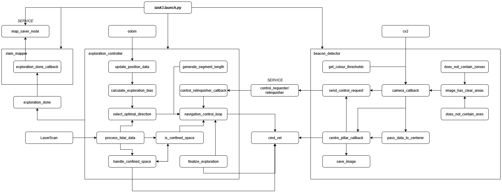

# TurtleBot Autonomous Explorer

## Summary

This ROS2 application enables a TurtleBot3 Waffle to autonomously explore an arena, avoiding obstacles and building an occupancy grid with SLAM. It uses LiDAR 
and odometry data to detect and navigate around obstacles while marking visited areas on a 3×3 grid. The robot moves in randomized segments with adaptive 
turning. Simultaneously, it identifies coloured beacons using the robot's camera, photographing it and saving the image when it is fully within view.

The system combines autonomous navigation, visual detection, and map generation for efficient environment exploration and documentation.

## Installation and Execution

This guide assumes ROS2 has been installed via [the University's Guide](https://tom-howard.github.io/com2009/ros/).

The system assumes Gazebo simulation by default. To run it on a physical Turtlebot, use the flag in_simulator:=True.

### Cloning the Repository

To clone our repository, navigate to `~/ros2_ws/src/` and run:

```bash
git clone https://github.com/aca23nhm/com2009_team65_2025.git
```

### Packages used

Our package requires the following python/ros2 packages to be installed in order to work properly:
- rclpy
- sensor_msgs
- geometry_msgs
- nav_msgs
- std_msgs
- cartographer_ros_msgs
- cv2
- ament_index_python

### Pairing the Robot

This guide assumes you are already familiar with the robot pairing process.

### Running the Navigation Program

Navigate to `~/ros2_ws/src` in a terminal and run the following commands:

```bash
colcon build --packages-select com2009_team65_2025 --symlink-install
source ~/.bashrc
ros2 launch com2009_team65_2025 task3.launch.py target_colour:=COLOUR
```
where `COLOUR` is one of {red, green, blue, yellow}.

Make sure the robot is placed in the arena before running the last command.


## Functional Description

### Navigation and Exploration Strategy

The `exploration_controller.py` file implements a navigation strategy inspired by Lévy flight. The robot moves in straight segments of random lengths followed 
by randomized turns. This results in broad, efficient coverage of the environment.

* Drives forward a random distance (0.3 m to 1.0 m)
* Rotates randomly between 45° and 180°
* If an obstacle is detected (< 0.25 m):

  * Stops
  * Reverses slightly
  * Rotates towards a safe heading based on LiDAR data

This reactive approach is simple, effective, and robust.

### Obstacle Avoidance

LiDAR provides 360° distance measurements. The robot monitors the forward sector for nearby obstacles:

* On detection:

  * Halts immediately
  * Reverses slightly
  * Scans for a direction with maximum clearance and rotates accordingly

This loop runs continuously for safe navigation.

### Zone Tracking

The robot uses its odometry to track which 1m squares in a 3x3 grid it has visited. It uses this information to guide its turns, in order to avoid backtracking.

## Beacon Detection and Photo Capture
A dedicated ROS2 node named BeaconDetector runs continuously. This is defined in beacon_detector.py. This node subscribes to the /camera/image_raw topic and 
uses OpenCV to process incoming frames. It is capable of taking control of the robot when required.

The detection pipeline consists of:

- Converting the RGB image to HSV colour space.
- Mask the image for the target colour.
- Aborting if the m00 image moment indicates the blob of colour is too small.
- Checking horizontal lines across the image, to ensure we haven't captured one solid block of colour (like a wall).
  - This feature is disabled in simulation, because it's not necessary in the low-noise environment.
- Once we think we have a real pillar, requesting control from the ExplorationController, and turning towards the centre of the block of colour.
- Once we're at the centre, taking a picture, handing control back to the ExplorationController, and shutting down the node.
    - If at any point we lose sight of the pillar, hand back control, and set a cooldown, so that the BeaconDetector does not immediately request control again 
if it sees a false or intermittent signal.

### Control Sharing
By defaut, the ExplorationController has control of the robot. When the BeaconDetector wants to turn towards a pillar, it makes a ControlSharingReq to the 
server that the ExplorationController exposes. The ExplorationController will then go dormant until the BeaconDetector is finished, and sends another service 
request to hand back control.


## SLAM and Map Saving
We run an instance of the in-built TurtleBot3 Cartographer node. Using SLAM techniques, it builds an occupancy grid as the robot moves around. 

At the end of the 3-minute run (or upon a shutdown signal), the current map is saved as a PNG image with a YAML metadata file, by sending a request to the 
map_saver node. This map is stored under the /maps/ directory and named arena_map.png.

This functionality ensures that the robot not only explores the environment but also leaves behind a usable record of the space it covered.



## Contributors

* [Lottie McGhee](https://github.com/drearyplane8)
* [Tommy Sargaison](https://github.com/tommmicron)
* [Nurul Husna Mohmad Hakim](https://github.com/aca23nhm)
* [Nik Farhanah Nik Zawawi](https://github.com/anahnick)
